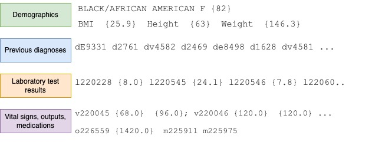
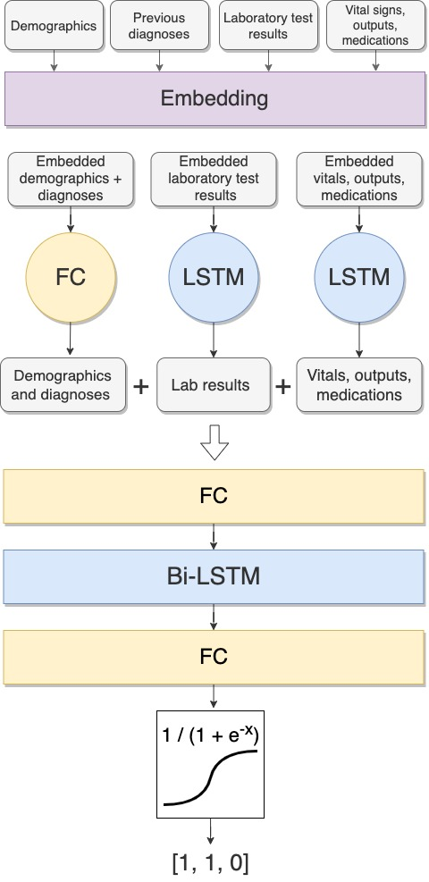

# Prediction of Acute Kidney Injury using Electronic Health Records.
The deep learning model for predicting Acute Kidney Injury (AKI) in ICU patients from Electronic Health Records (EHR) database MIMIC IV v2.0.

## Project description
Acute Kidney Injury (AKI) affects more than 13 million people annually and increases
the risk of death in patients[26]. The severity of AKI also contributes to the increase
in associated costs of a patient’s treatment. The early prediction of AKI could enable
clinicians to focus on preventive treatment for at-risk patients.

In addition to the classical machine learning approach called The extreme gradient boosting (XGBoost) with manual feature selection,
we have also explored an LSTM-based approach applied to the prediction of AKI. Due to
the variety of data available for each patient, it is challenging to assess which information
could be the best predictor. Thus, the text classification model used unstructured textual
data to make predictions. 

### Data preprocessing
Before being passed to the model the data should be preprocessed in the certain way. The input data are combined into four blocks:
- demographics (which includes both: demographic information and semi-static body
measurements);
- previous diagnoses;
- laboratory test results taken during the first 24h in the ICU;
- vital signs, urine output volume recorded during two 12h windows and medications
prescribed during the same two 12h windows from the time of transferring to the
ICU.

The code for preprocessing is stored in this repository. The example of the input data is shown below:

  

 
### Architecture of the model
Every number in the text was enclosed in brackets in order to pass the sense of the start
and the end of the numerical information to the model. Each of these blocks is converted
into a tensor and then tokenized using Byte-Pair Encoding (BPE) technique. For each of
the tensors, we define the maximum length in tokens. Thus, if an input text is tokenized
into more tokens than the maximum length, we truncate it. On the other hand, if the
text input has fewer tokens than the maximum length, we pad the sequence with special
token ’PAD’. Each tokenized block has a special token at the beginning and end of the
text (before the padding tokens).

Then, we concatenated the static information blocks - demographics and previous diagnoses. Each resulting tokenized vector is passed to an embedding layer to get the representations of the input text. The representations of the static information are passed toa fully-connected layer, while the representations of the continuous information are passed to the LSTM layer. After that, the outputs of both layers are concatenated and passed to the other fully-connected layer. Then the output is passed to the bidirectional LSTM layer. Finally, the dropout is applied to the output from the LSTM layer, and then the resulting tensor is passed through another fully-connected layer with three output nodes. Then, the sigmoid activation function is applied to the model’s output. 

The architecture of the model is shown below:

  

The model was able to achieve the sensitivity of 57% and the precision of 29%, which corresponds to 2.5 false positive predictions for each true positive.

## Files description
The database is publicly available on [Physionet MIMIC-IV](https://physionet.org/content/mimiciv/2.0/) page.

- File icu_preprocessing.ipynb is used to preproccess the data into the format suitable for the model.
- File icu_lstm_sigmoid.py contains all functions and modules for training and evaluating the model.
- File Cohort_analysis.ipynb contains initial analyses of the data used to train the model. 
- File icu_xgb.ipynb is used to train and evaluate XGBoost AKI prediction model. Preprocessing pipeline for XGBoost is located in the icu_preprocessing.ipynb file.
- File tokenizer.json is a trained tokenizer used in the model training.

Please let me know if you have any questions by the folloving email: maslenkova.lana@gmail.com
